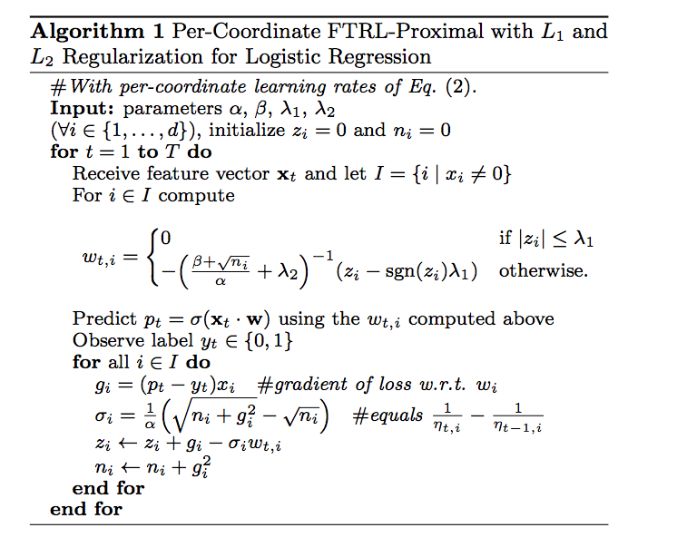

## What is this?

R package which implements [Follow the proximally-regularized leader](http://www.jmlr.org/proceedings/papers/v15/mcmahan11b/mcmahan11b.pdf) algorithm. It allows to solve very large problems with stochastic gradient descend online learning. See [Ad Click Prediction: a View from the Trenches](https://www.eecs.tufts.edu/~dsculley/papers/ad-click-prediction.pdf) for example.


## Features

- Online learning - can easily learn model in online fashion
- Fast (I would say very fast) - written in `Rcpp`
- Parallel, asyncronous. Benefit from multicore systems (if your compiler supports openmp) - [Hogwild!](https://arxiv.org/abs/1106.5730) style updates under the hood

## Notes

- Only logistic regerssion implemented at the moment
- Core input format for matrix is CSR - `Matrix::RsparseMatrix`. Hoewer common R `Matrix::CpasrseMatrix` ( aka `dgCMatrix`) will be converted automatically

## Todo list

- gaussian, poisson family
- vignette
- improve test coverage (but package battle tested on [kaggle outbrain competition](https://www.kaggle.com/c/outbrain-click-prediction) and contribute to our 13 place)

## Quick reference

```r
library(Matrix)
library(FTRL)
N_SMPL = 5e3
N_FEAT = 1e3
NNZ = N_SMPL * 30

set.seed(1)
i = sample(N_SMPL, NNZ, TRUE)
j = sample(N_FEAT, NNZ, TRUE)
y = sample(c(0, 1), N_SMPL, TRUE)
x = sample(c(-1, 1), NNZ, TRUE)
odd = seq(1, 99, 2)
x[i %in% which(y == 1) & j %in% odd] = 1
m = sparseMatrix(i = i, j = j, x = x, dims = c(N_SMPL, N_FEAT), giveCsparse = FALSE)
X = as(m, "RsparseMatrix")

ftrl = FTRL$new(alpha = 0.01, beta = 0.1, lambda = 20, l1_ratio = 1, dropout = 0)
ftrl$partial_fit(X, y, nthread = 1)
accuracy_1 = sum(ftrl$predict(X, nthread = 1) >= 0.5 & y) / length(y)

w = ftrl$coef()


ftrl$partial_fit(X, y, nthread = 1)
accuracy_2 = sum(ftrl$predict(X, nthread = 1) >= 0.5 & y) / length(y)

accuracy_2 > accuracy_1
```
